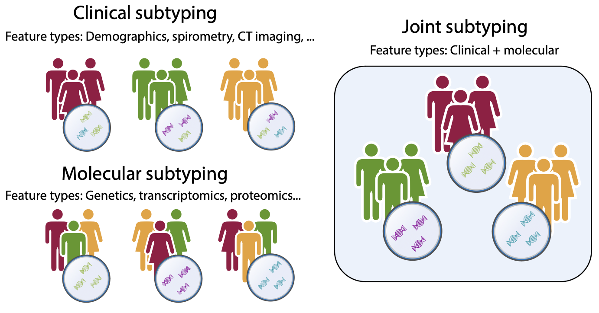

# Code for paper "Joint Clinical and Molecular Subtyping of COPD with Variational Autoencoders", Maiorino et al.

[](License.md)

## Description



Code for reproducing results in the manuscript "Joint Clinical and Molecular Subtyping of COPD with Variational Autoencoders", Maiorino et al.

## Table of Contents

- [Installation](#installation)
- [Usage](#usage)
- [Contact](#contact)
- [License](#license)

## Installation

Create a conda environment

```bash
conda create -n joint_subtyping_vae python=3.7.10
```

Then, install code package

```bash
git clone https://github.com/reemagit/joint_subtyping_vae
cd joint_subtyping_vae
pip install -r requirements.txt
pip install .
```

(OPTIONAL) Some processing scripts require ```R``` (version 3.6.3) to be installed, along with the packages ```lme4```, ```DeSeq2```, and ```edgeR```. 

### Data download

- The minimal data to execute the analysis scripts can be downloaded from the zenodo repository at https://zenodo.org/records/10431494. We assume that ```$MAIN_DIR``` contains the path of the zenodo folder.

- All COPDGene data used for training the VAE (raw gene expression data and clinical features) are available in dbGaP (accession number [phs000179.v6.p2](https://www.ncbi.nlm.nih.gov/projects/gap/cgi-bin/study.cgi?study_id=phs000179.v6.p2)).

## Usage

### Toy data example

For illustrative purposes, we consider a scenario in which a person may exhibit one of two distinct gene expression signatures (A or B) and one of two unique clinical presentations (1 or 2). These states are each characterized by their own specific distributions. 

We consider 4 subtypes: 

- Subtype A1 (genetic profile A with clinical presentation 1)
- Subtype B1 (genetic profile B with clinical presentation 1)
- Subtype A2 (genetic profile A with clinical presentation 2)
- Subtype B2 (genetic profile B with clinical presentation 2)

We generate a dataset of 1,000 individuals that are distributed uniformly across these 4 subtypes.

This dataset is located at ```$MAIN_DIR/toy_example```. 

The main script to train the VAE is ```train/train_model.py``` (type ```train/train_model.py --help``` to see the available options). In this example, we train the VAE with the following command:

```bash
python train/train_model.py $MAIN_DIR/toy_data $MAIN_DIR/toy_data/results -n 100 -z 2 -h1 10,5 -h2 10,5 -s 0
```

Here we set 2 embedding dimensions (argument ```-z 2```) to allow for easy visualization, 100 training iterations, and two hidden layers per data type with 10 and 5 units.

In the output directory ```$MAIN_DIR/toy_data/results``` we will get the embeddings (```embeddings.tsv```), the torch model file (```model.pth```), the torch optimizer state (```optimized.pth```), and the dataset splits (```splits_df.tsv```).

By plotting the dataframe in ```embeddings.tsv``` we will get 


As shown here, the 4 subtypes are easily distinguishable in the VAE embedding space.

### Reproducing the results in the paper

The following commands can be used from reproducing the results in the paper:

**Outcome prediction**

Evaluate the prediction performances:

```bash
python analysis/outcome_prediction.py $MAIN_DIR/model $MAIN_DIR -o $MAIN_DIR/outcome_prediction 
```

and then produce the Latex code for printing the table

```bash
python plots/classification_table.py $MAIN_DIR/outcome_prediction/classification_avg.tsv $MAIN_DIR/outcome_prediction/classification_std.tsv $MAIN_DIR/outcome_prediction/classification_pval.tsv -o $MAIN_DIR/outcome_prediction/table.tex
```

**Trajectories**

Trace the trajectories using [```elPiGraph```](https://sysbio-curie.github.io/elpigraph/). We execute the algorithm on the original VAE embeddings and on the resampled embeddings

```bash
python analysis/elpigraph_tree.py $MAIN_DIR/model/embeddings.tsv $MAIN_DIR/elpi -p $MAIN_DIR/stability/
```

**GSEA enrichment**

Perform differential expression (DE) with the [```DeSeq2```](https://bioconductor.org/packages/release/bioc/html/DESeq2.html) package and GSEA with [```gseapy```](https://pypi.org/project/gseapy/) package:

```bash
Rscript analysis/de.R $MAIN_DIR
python analysis/enrichment.py $MAIN_DIR/de $MAIN_DIR/de
```

and plot the results

```bash
python plots/gsea_enrichment.py $MAIN_DIR/de $MAIN_DIR/de/plots/enrichment.pdf
```

**Prospective analysis**

Evaluate results of prospective analysis of COPD outcomes

```bash
python analysis/prospective.py $MAIN_DIR $MAIN_DIR/prospective
Rscript analysis/prospective_exac_glm.r $MAIN_DIR
```

and plot the results

```bash
python plots/exacerbations_glm.py $MAIN_DIR $MAIN_DIR/prospective/plots
```

**Plots of clinical features**

```bash
python plots/feature_plot.py $MAIN_DIR "FEV1pp_utah_P2" $MAIN_DIR/clinical_features/FEV1pp_utah_P2.pdf # FEV1 % of predicted
python plots/feature_plot.py $MAIN_DIR "pctEmph_Thirona_P2" $MAIN_DIR/clinical_features/pctEmph_Thirona_P2.pdf # % emphysema (CT assessed)
python plots/feature_plot.py $MAIN_DIR "Chronic_Bronchitis_P2" $MAIN_DIR/clinical_features/Chronic_Bronchitis_P2.pdf --plot-type bar # Chronic bronchitis
python plots/feature_plot.py $MAIN_DIR "Exacerbation_Frequency_P2" $MAIN_DIR/clinical_features/Exacerbation_Frequency_P2.pdf --plot-type bar # Exacerbation frequency
```

**Data preprocessing**

The data preprocessing scripts for processing the raw COPDGene data are the following: 

- ```preprocess``` folder: raw scripts to process gene expression data, the clinical features, and the mortality data.
- ```analysis/pca.py```: compute the PCA scores for evaluating the PCA embeddings
- ```analysis/cca.py```: compute the CCA scores for evaluating the CCA embeddings
- ```analysis/mofa.py```: compute the MOFA scores for evaluating the MOFA embeddings

## Contact

For information of questions please contact ```enrico.maiorino at channing.harvard.edu```.

## License

This project is licensed under the [MIT License](License.md).
